# CSE15L Lab Report 1: Remote Access
Hantian Lin A16923770

---
## Installing VScode
* Go to [Visual Studio Code website](https://code.visualstudio.com/).
* Click the blue button "**Download**".
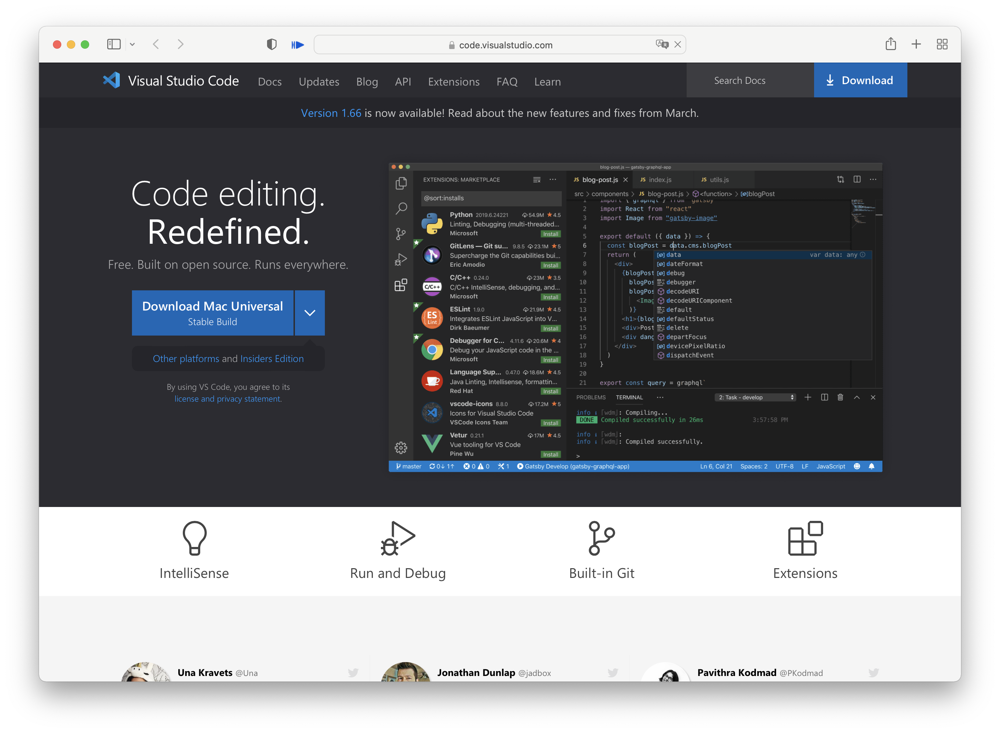
* Choose the correct version respecting to your system to install (Windows, Linux, or MacOS).
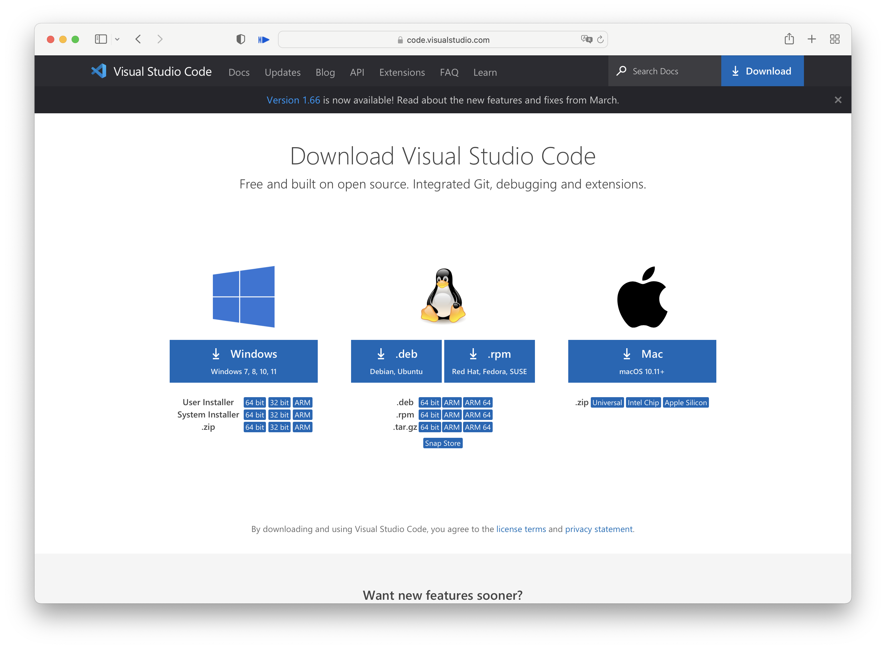
* After installing and opening up VS Code, you should be able to see a window like this:
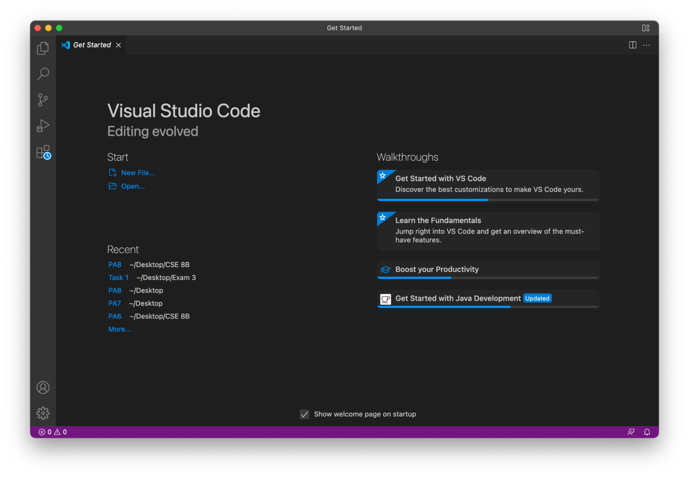

---
## Remotely Connecting
* Make sure you know your username for the remote computer.
* In VS Code terminal, type `ssh (username)@ieng6.ucsd.edu`, then type your password.
* If the terminal asks `Are you sure you want to continue connecting (yes/no/[fingerprint])?`, type `yes`.
* The terminal should print something similar to the following:
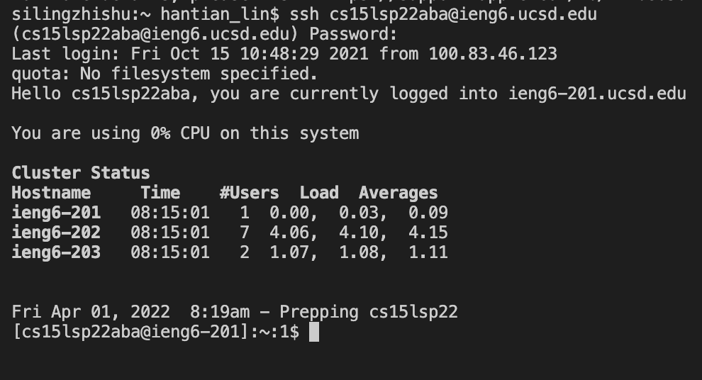
* Now, the terminal is connected to the remote computer.

---
## Trying Some Commands
* Below are some examples of viable commands.
* Command `ls -a` **lists all the files in the directory**:
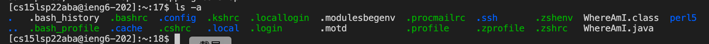
* Command `pwd` **prints the current working directory**:
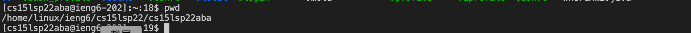
* Command `mkdir` **creates a new directory with the chosen name**:
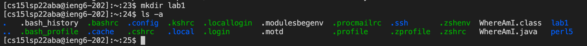
* Command `cd` **changes the current directory to the chosen directory**:
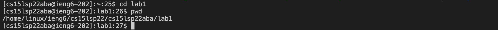

---
## Moving Files with `scp`
* This command **moves a file from the local computer to a remote computer**.
* In the terminal, without logging into ssh, type `scp (file name) (username)@ieng6.ucsd.edu:~/`
* For example, if I want to copy `WhereAmI.java` from my computer to ssh, I would type `scp WhereAmI.java cs15lsp22aba@ieng6.ucsd.edu:~/`
* The terminal should print something similar to the following:
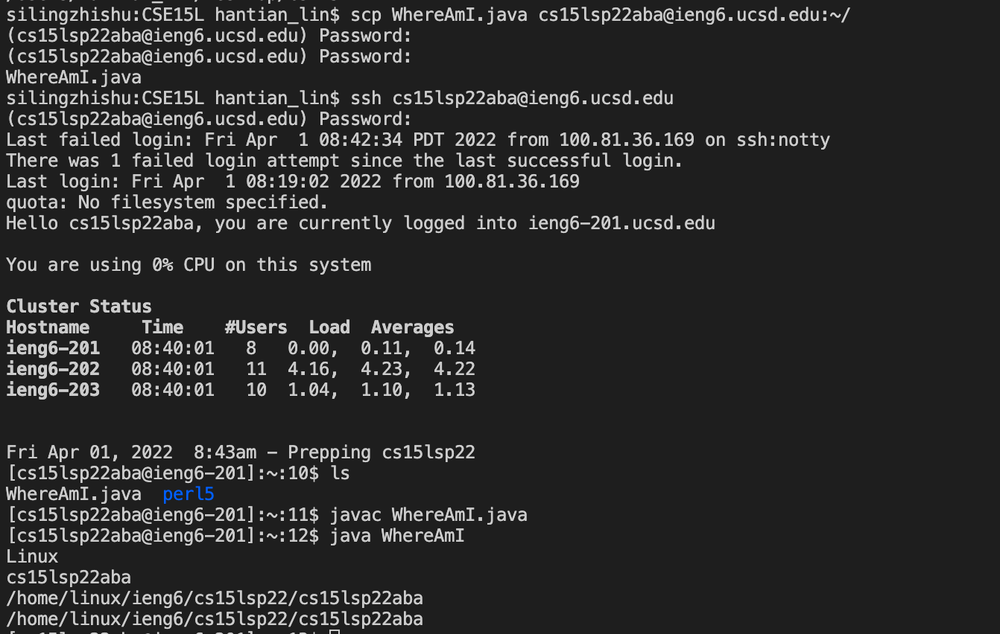
* You can then compile and run `WhereAmI.java` in the remote computer.

---
## Setting an SSH Key
* SSH key allows one to log into the remote computer without repeatedly inputting the complicated password.
* Type `$ ssh-keygen`
* The terminal should ask the following:
```
Generating public/private rsa key pair.
Enter file in which to save the key (/Users/hantian_lin/.ssh/id_rsa): 
```
* Enter `/Users/(your-local-computer-username)/.ssh/id_rsa`
* The terminal should ask you to enter your passphrase twice, but you have to leave both blank.
* After that, the terminal should print something similar to the following:
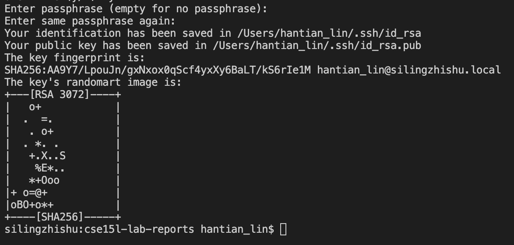
* Then, type `$ ssh (username)@ieng6.ucsd.edu` and enter password to login into the remote computer.
* Type `$ mkdir .ssh` to create a new directory named ssh on the remote computer.
* Exit the remote computer.
* Type `scp /Users/(your-local-computer-username)/.ssh/id_rsa.pub (username)@ieng6.ucsd.edu:~/.ssh/authorized_keys` to copy the public key from the local to the remote computer.
* Finally, you can use `ssh` and `scp` now without inputting password.

---
## Optimizing Remote Running
* There are some tips to increase efficiency when typing commands.
* Use **up arrow** to repeat the previous commands.
* Use **tab** to auto-fill file paths and names.
* Use **copy and paste** to input complex paths.
* Type multiple commands in one line by using **semicolon** to separate commands as shown:
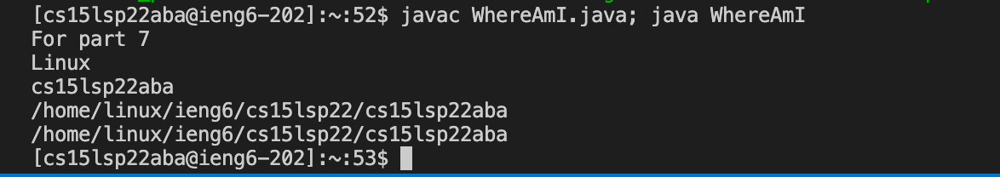