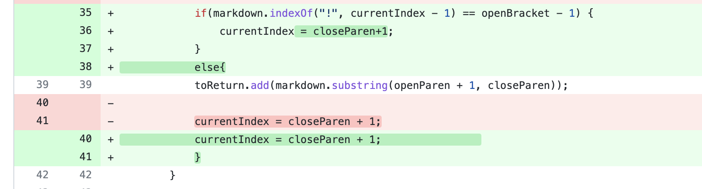
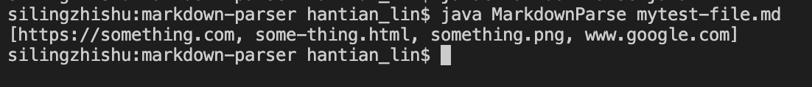

# CSE15L Lab Report 2 Week 4
Hantian Lin A16923770

---
## First code change
* Code diff:

* * [Link to the failure-inducing input](https://github.com/HantianLin/markdown-parser/blob/main/mytest-file.md)
* Symptom of the failure:

* The file contains images. However, the name of image should no be considered as an actual link even though it is also surrounded by brackets.\
The symptom is that the code also outputs the image link.\
The fix includes an if-else statement to exclude the link after the exclamation mark.

---
## Second code change
* Code diff:

* [Link to the failure-inducing input](https://github.com/HantianLin/markdown-parser/blob/main/new-file.md)
* Symptom of the failure:

* The file contains empty lines before. between, and after links. The original code cannot skip these empty lines.\
The symptom is that there is no ouput. The code is trapped in an infinite loop, causing OutOfMemory exception.\
Therefore, there would be no open or close parenthesis to search for, thus the current index would never get updated to escape the while-loop.

---
## Third code change
* Code diff:

* [Link to the failure-inducing input](https://github.com/HantianLin/markdown-parser/blob/main/test-file3.md)
* Symptom of the failure:

* The file only contains open and close brackets but no open or close parenthesis.\
Therefore, both indexOf methods locating parenthesis would return -1.\
Later in the code, when using the index of open and close parenthesis to coordinate the substring method, the symptom is that the substring method would cause StringIndexOutOfBoundsException since -1 is an invalid index.\
At this point, MarkdownParse passed every test file from lab 3.