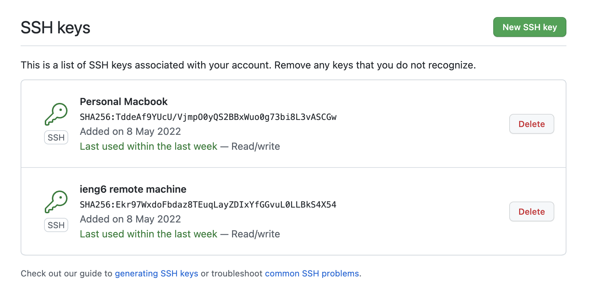
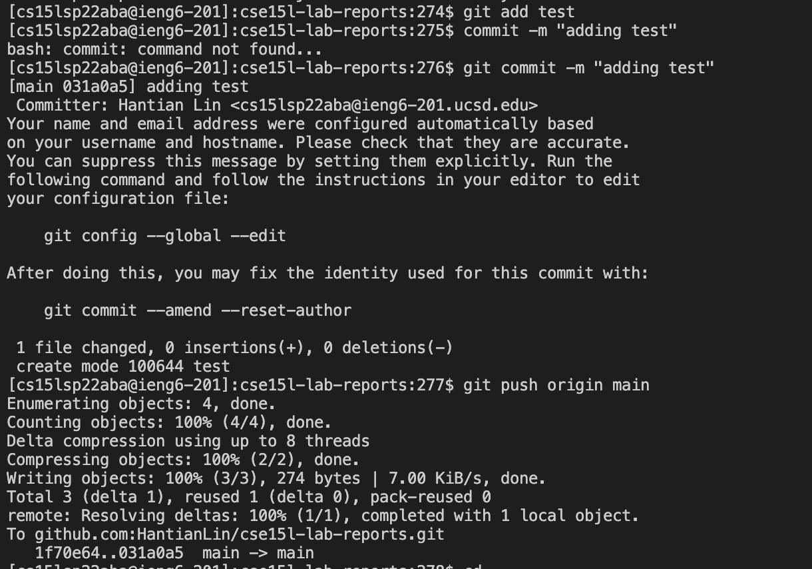
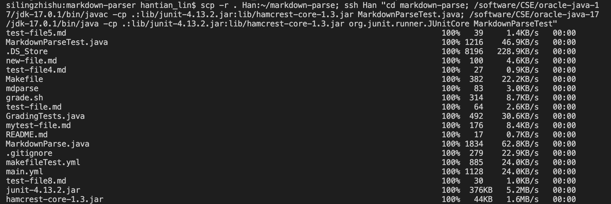
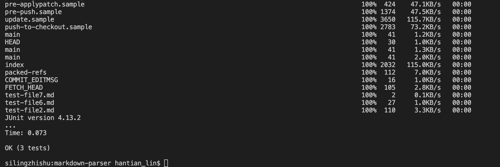

# CSE15L Lab Report 3 Week 6
Hantian Lin A16923770

---
## Streamlining ssh Configuration
* My `.ssh/config` file:

I had a hard time manually finding the `.ssh` folder and create the `config` file, so I used terminal instead. I typed the following:

I created and opened the `config` file using terminal and manually typed in the above lines.
* After the `config` file is setted up, I can just type `Han` instead of my full username + hostname, as shown:

* I also used `scp` to copy `RPS.java` to the remote machine using the alias in the terminal, as shown:

---
## Setup Github Access from ieng6
* I stored two SSH keys on Github, one for my local computer and one for my ieng6 remote computer, as shown:

* The public and private keys are stored in ieng6 remote computer in `.ssh` directory, as shown:

* Here, I created and added a file named `test` to my repo, and used `git commit -m "(comment)"` and `git push origin main` to do the work, as shown:

[Link to this commit](https://github.com/HantianLin/cse15l-lab-reports/commit/031a0a559353c15c1a3e695e533a48045b65d893)
> **Note to myself:**\
Remeber to run command `git remote set-url origin <put ssh URL here>` on the desinated repository directory (you might need to clone the repo first).\
If you run into issues with establishing SSH on remote machines such as "fatal: Authentication failed", you can create a `config` file and scp the file into that directory, as shown:

---
## Copy whole directories with `scp -r`
* I used `scp` to cpoy the entire `markdown-parse` directory to the remote machine, as shown:

and by checking using `ls`, the directory is indeed there, as shown:

* After copying, I can compile and run the tests, as shown:

* I can improve efficiency by combing `scp` and `ssh` commands when compiling and running tests, as shown:

> **Useful commands for the test file:**\
To compile: `javac -cp .:lib/junit-4.13.2.jar:lib/hamcrest-core-1.3.jar MarkdownParseTest.java`\
To run: `java -cp .:lib/junit-4.13.2.jar:lib/hamcrest-core-1.3.jar org.junit.runner.JUnitCore MarkdownParseTest`

> **Note to myself:**\
Ff you run into issues with cannot find the symbol, Piazza offers the advise to replace the `javac` and `java` with `/software/CSE/oracle-java-17/jdk-17.0.1/bin/javac` and `/software/CSE/oracle-java-17/jdk-17.0.1/bin/java` respectively. 