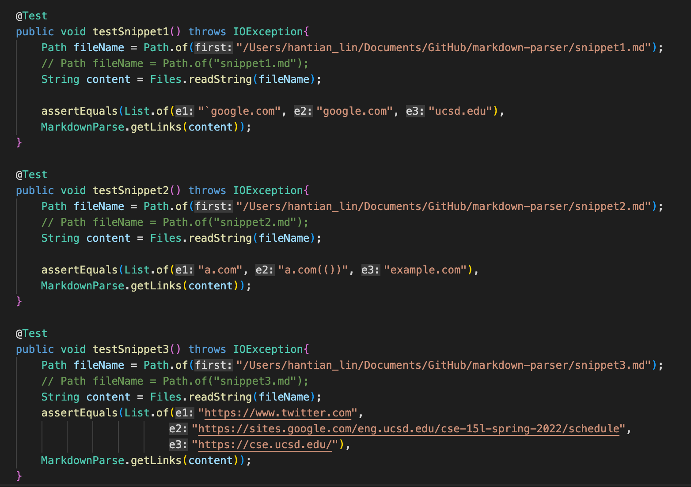
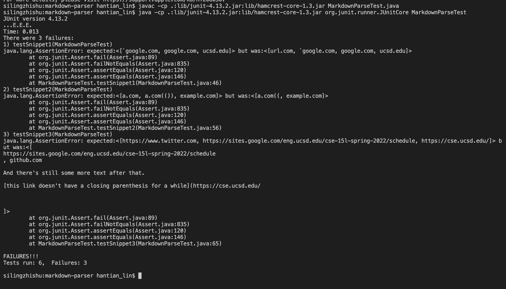
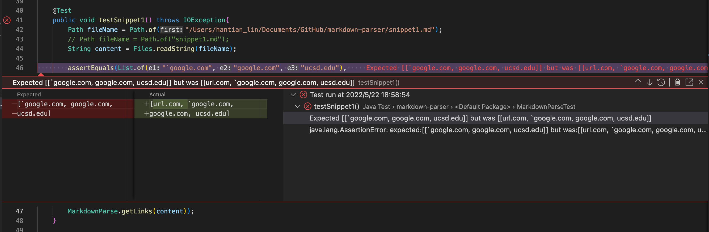
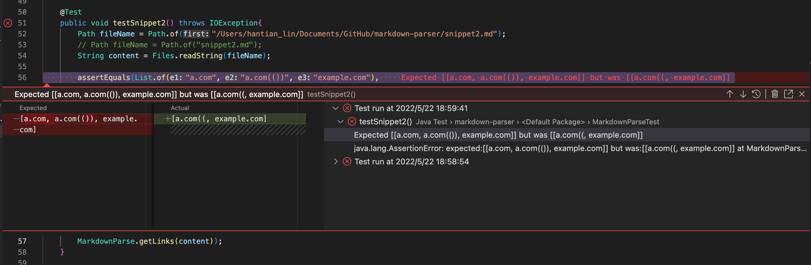
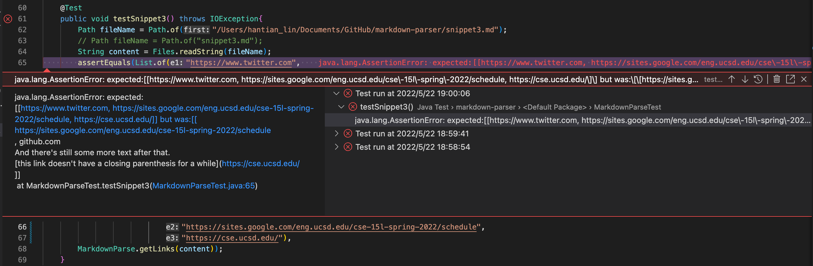
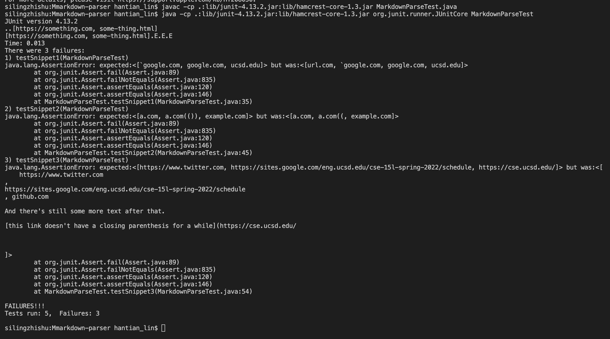
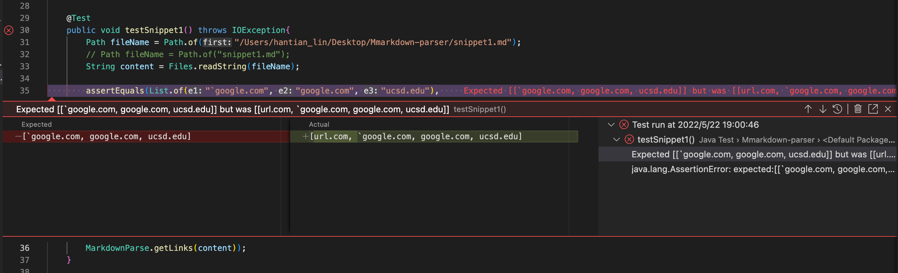
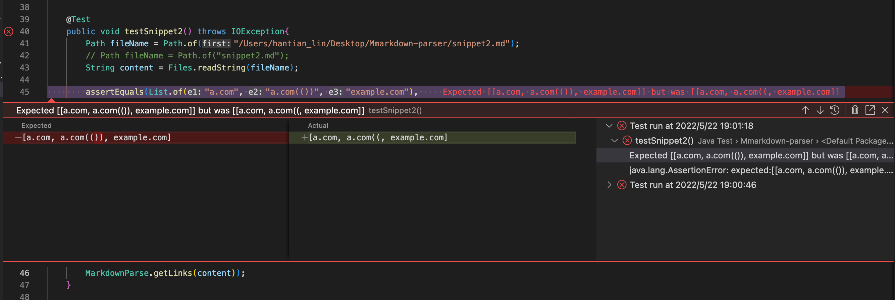
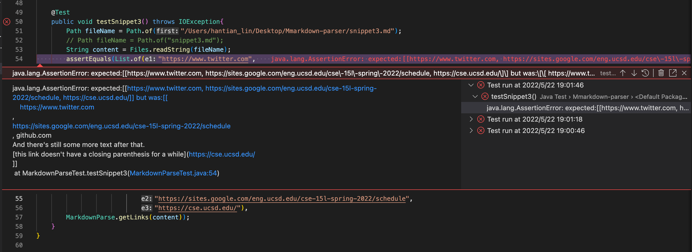

# CSE15L Lab Report 4 Week 8
Hantian Lin A16923770

---

[Link to my repository](https://github.com/HantianLin/markdown-parser)\
[Link to the repository I reviewed](https://github.com/michellem8/markdown-parser)

---

The code in `MarkdownParseTest.java` for how I turned the three snippets into tests:

---

In my implementation, the tests did not pass:

JUnit output for snippet1's failure:

JUnit output for snippet2's failure:

JUnit output for snippet3's failure:

---

In the implementation I reviewed, the tests also did not pass:

JUnit output for snippet1's failure:

JUnit output for snippet2's failure:

JUnit output for snippet3's failure:

---

Do you think there is a small (<10 lines) code change that will make your program work for snippet 1 and all related cases that use inline code with backticks?

- Yes. I can use an if-else statement to exclude the cases where there are punctuation disrupting the pattern of brackets and parenthesis by checking the characters around and inside the brackets.

Do you think there is a small (<10 lines) code change that will make your program work for snippet 2 and all related cases that nest parentheses, brackets, and escaped brackets?

- Yes. I should only consider the brackets/parenthesis if the immediate next bracket/ parenthesis has an opposite facing direction. For example, if a opening bracket is followed by another opening bracket, then the first opening bracket should be ignored, only considering the inner-most pair(s) of brackets and their corresponding links. I can also use an if-else to resolve this.

Do you think there is a small (<10 lines) code change that will make your program work for snippet 3 and all related cases that have newlines in brackets and parentheses?

- No, the solution would be bigger. I need to consider the situation where there are empty lines between a pair of brackets/parenthesis. In this case, I would need to keep searching for a close bracket/parenthesis even across the lines. I need to stop searching if I reach a open bracket, and discard everything before.