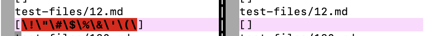
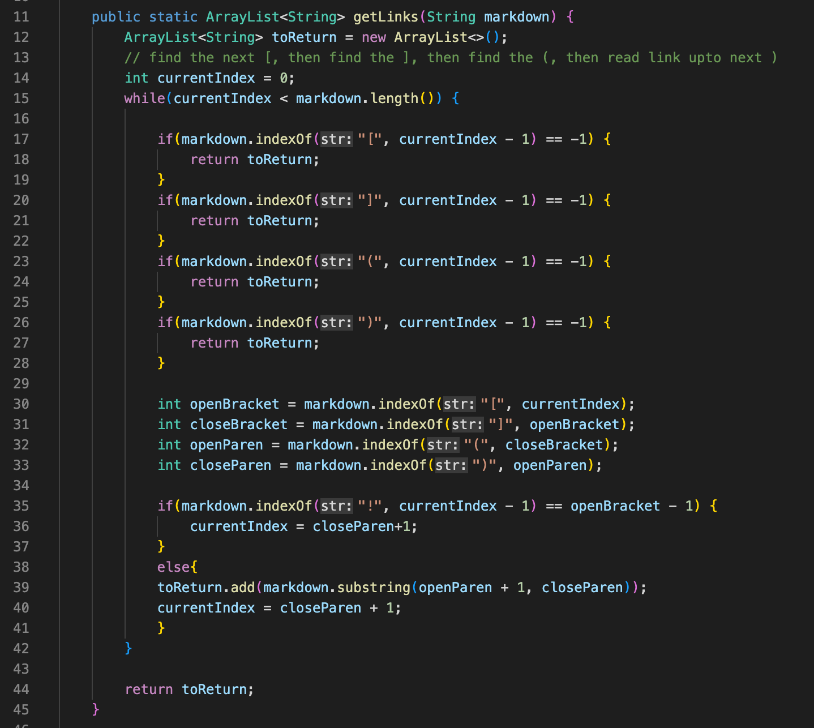
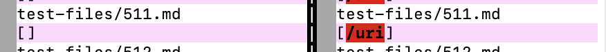

# CSE15L Lab Report 5 Week 10
Hantian Lin A16923770

---
- I used vimdiff to find the bug. I stored the test results from both `MarkdownParse.java` in two different text files named `results` using command `bash script.sh > results.txt`.
- Then I typed `$ vimdiff my-markdown-parser/results.txt cse15lsp22-markdown-parser/results.txt` to open vimdiff window.

---
## First bug: [test-files 12](https://github.com/nidhidhamnani/markdown-parser/blob/main/test-files/12.md)

- My implementation is not correct. The expected link output should be **empty** since there is no valid link in test-file 12.

- The error happens in the block from line 30 to 33.
- Since the test file does not contain brackets or open parenthesis before the close parenthesis, the value of `openBracket`, `closeBracket`, and `openParen` would not get updated, so everything from index 0 to the close parenthesis would be added to `toReturn`.
- The fix is that the method should not start extracting substrings unless there is a pair of brackets followed by a pair of parenthesis.

---
## Second bug: [test-file 511](https://github.com/nidhidhamnani/markdown-parser/blob/main/test-files/511.md)

- My implementation is not correct. The expected link output should be `/url`. Even though the title part has nested brackets, the content inside the pair of parenthesis is still treated as a link.

- The error also happens in the block from line 30 to 33.
- The code is unable to handle nested brackets or parenthesis. The bracket/parenthesis search would stop after finding the immediate next closing bracket/parenthesis, instead of after finding the outter-most closing bracket/parenthesis.
- To resolve this, I can add a counter to count the number of open bracket/parenthesis, incrementing by one until I reach a closing one. Then, every time I pass a closing bracket/parenthesis, I decrement the counter until it reaches zero, which means I passed every nested bracket/parenthesis.